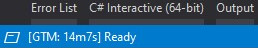

# GTM Visual Studio plugin

[Git Time Metric](https://github.com/git-time-metric/gtm) plugin for [Visual
Studio](https://visualstudio.com/).

## Features

Currently, this plugin only reports your interaction in Visual Studio to GTM and
shows the time spent on the current file in the status bar:

